<div align="center">

**English** | [繁體中文](README_zh-TW.md)

# PRISM: Physics-Radio Integrated Simulation and Management for V2X Digital Twins

**Chia-Chuan Chiu<sup>\*</sup>, Ming-Chun Lee<sup>\*</sup>, Yung-Sheng Chao<sup>†</sup>, Li-Chun Wang<sup>\*</sup>**

<sup>\*</sup>College of Electrical and Computer Engineering, National Yang Ming Chiao Tung University, Taiwan<br>
<sup>†</sup>National Chung-Shan Institute of Science and Technology, Taiwan

**IEEE VTC2026-Spring**

[📄 Paper (PDF)](PRISM_VTC2026_Spring.pdf) · [📝 Citation](#citation)

</div>

---

**PRISM** is a physics-radio integrated simulation and management platform for vehicle-to-everything (V2X) digital twins. It co-simulates wireless propagation with [Sionna](https://nvlabs.github.io/sionna/) ray tracing and vehicle dynamics with [CARLA](https://carla.org/). The modules talk to each other through MCP-inspired, human-readable JSON commands.

<p align="center">
  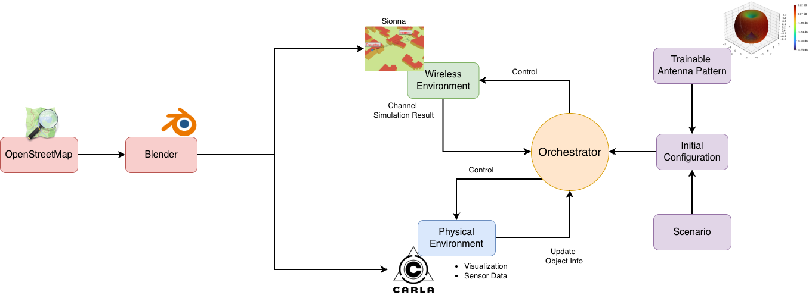
  <br><em>Architecture of PRISM.</em>
</p>

## Highlights

- **Multimodal co-simulation architecture.** A modular framework that keeps CARLA vehicle mobility and Sionna ray tracing in sync. It generates spatially and temporally aligned multimodal data: RGB camera, depth, semantic segmentation, mobility and wireless channel.
- **Context-driven execution.** An MCP-inspired control interface sends structured JSON commands over UDP. These commands are easy for people to read and work well with LLMs. The design supports distributed deployment, runtime reconfiguration and plug-in external modules.
- **Gradient-based antenna pattern reconstruction.** Uses Sionna's differentiable ray tracing to learn antenna patterns from limited measurement data, which narrows the sim-to-real gap without detailed antenna specifications.

## Demo

### CARLA ↔ Sionna co-simulation

CARLA updates vehicle positions and renders the physical world. The orchestrator forwards each object's position to Sionna, which runs ray tracing on the same timestamp.

<p align="center">
  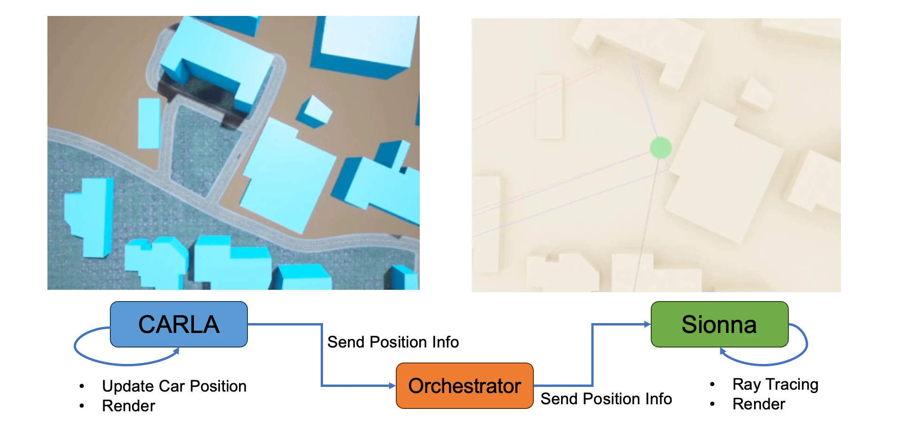
</p>

### Spatial-temporal aligned multimodal data

<p align="center">
  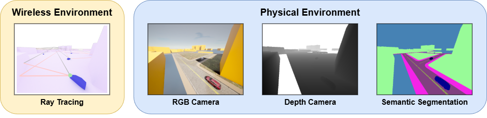
</p>

### Closed-loop beam selection via an external control module

A roadside unit (RSU) has three 28 GHz beams (30° HPBW, separated by 15° in azimuth) and serves a vehicle that moves along the red arrows. The wireless environment streams TX/RX positions to an **external control module**, which picks the best beam and sends it back. The core simulation workflow does not change.

<p align="center">
  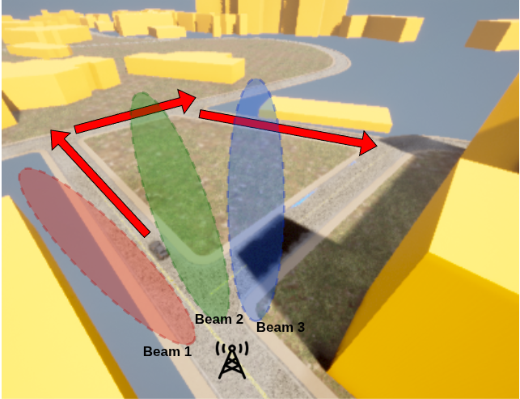
  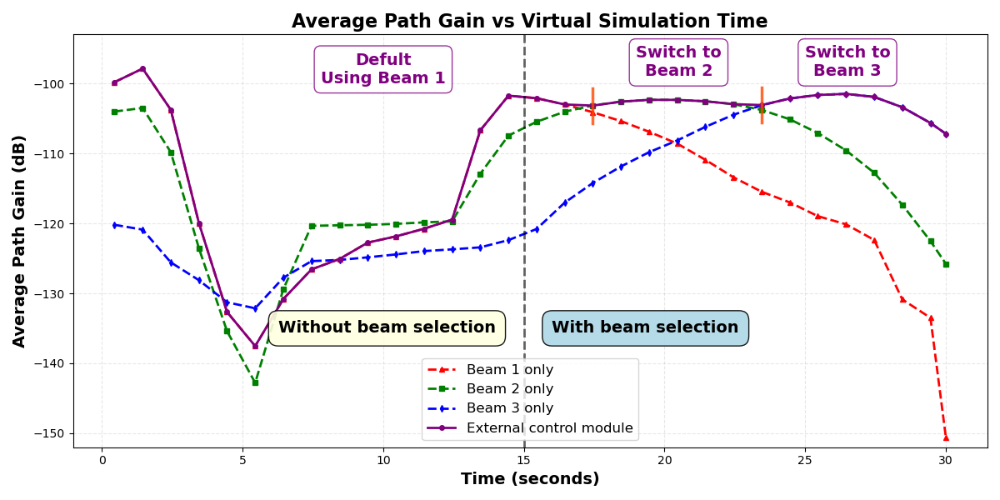
</p>

For the first 15 s, the system keeps the default beam 1. Once beam selection turns on, the external module switches to beam 2 at 17 s and to beam 3 at 23 s, so the vehicle stays on the best path gain for the rest of the run.

### Antenna pattern reconstruction

The TX antenna pattern is modelled as $G(\theta,\phi)=\left|\sum_{k=0}^{N-1} a_k \cos(k\theta)\right|$ with trainable coefficients $a_k$. The coefficients are fit by back-propagating through the differentiable ray tracer, using 1,000 received-power samples from an indoor scene. The reconstructed pattern reaches **1.6 dB RMSE** indoors and stays around **3 dB** when transferred to the outdoor NYCU campus map.

| Target | Initial | Epoch 10 | Epoch 50 | Epoch 100 |
|:---:|:---:|:---:|:---:|:---:|
| 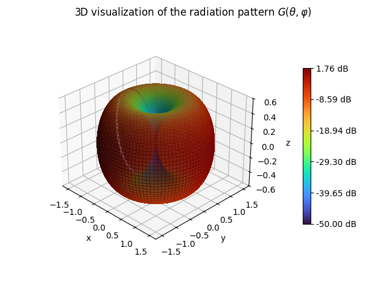 | 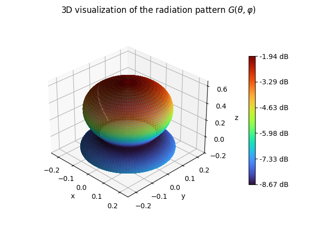 | 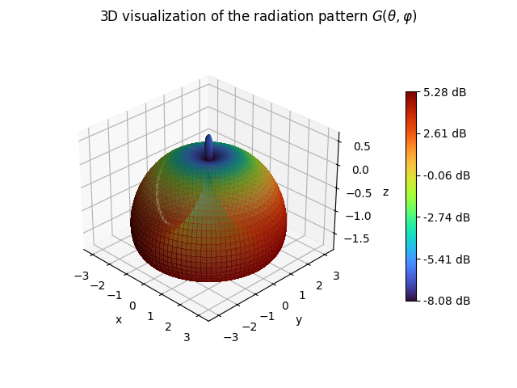 | 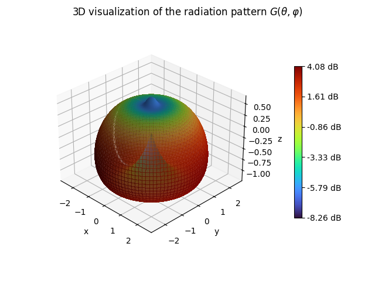 | 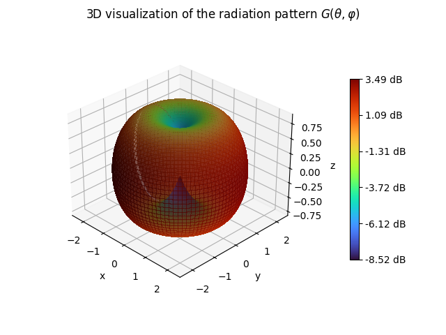 |

### Scenes

| NYCU campus (~1200 m × 1200 m, from OpenStreetMap) | Indoor map (used for antenna training) |
|:---:|:---:|
| 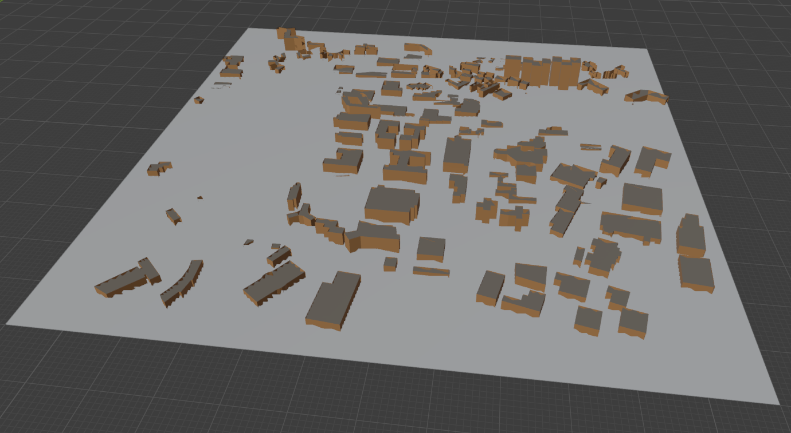 | 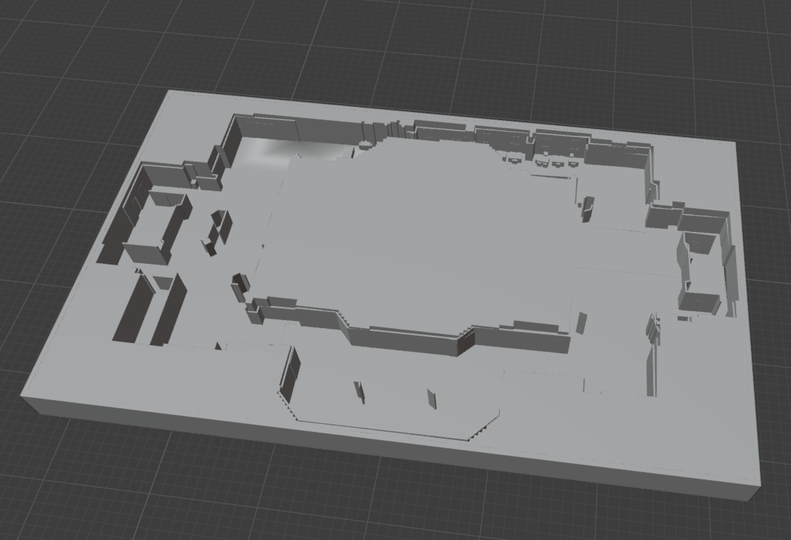 |

### Computation time

Measured on an Intel Ultra 7 265K, an NVIDIA RTX 5070 Ti (16 GB) and 32 GB RAM.

| CARLA step time vs. #vehicles | Ray tracing time vs. #RX (depth = 5) | Ray tracing time vs. depth (1 TX) |
|:---:|:---:|:---:|
| 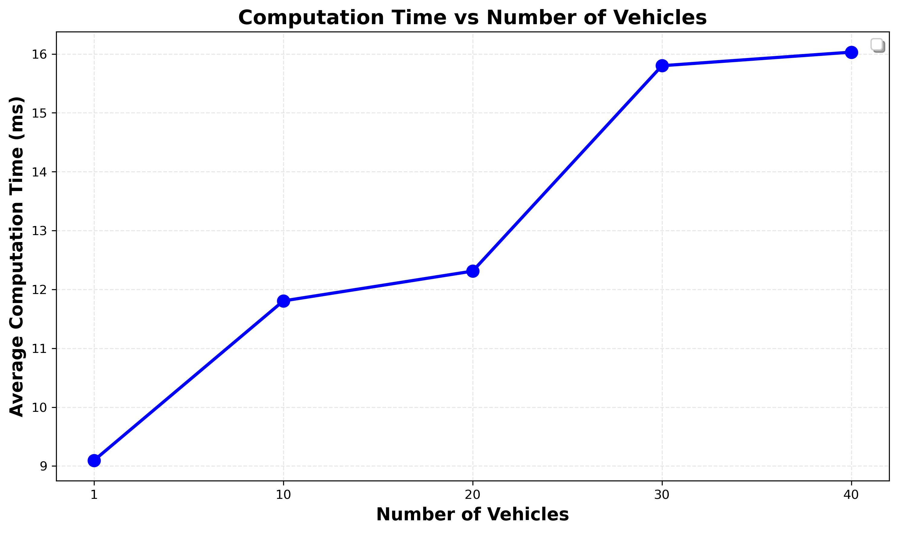 | 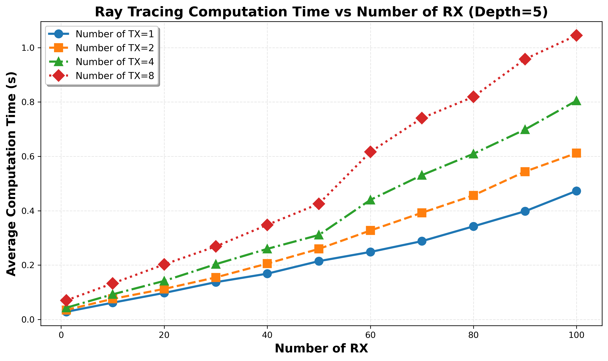 | 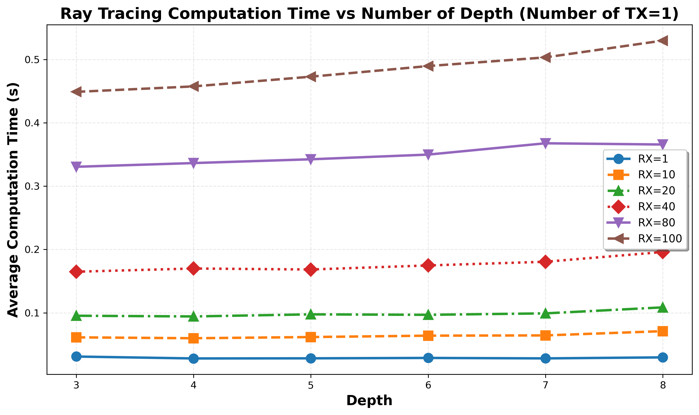 |

- With 1 to 40 vehicles, the physical environment takes **9 to 16 ms** per 0.1 s simulation step.
- Ray tracing takes **under 30 ms** for 1 TX / 1 RX and about **1 s** for 8 TX / 100 RX at 28 GHz. Increasing the ray tracing depth adds little time.

---

## Repository structure

```
.
├── run_scheduler.py               # Orchestrator: loads the scenario and routes JSON commands
├── run_wireless_env.py            # Wireless environment: Sionna ray tracing + link-level simulation
├── run_visualizer.py              # Physical environment: CARLA client, sensors, dataset writer
├── run_external_module.py         # External control module (closed-loop beam selection use case)
├── simulation_config_with_carla.json  # Initial configuration / scenario (list of JSON commands)
├── utils.py                       # NetworkComponent: UDP + JSON messaging base class
├── commu_modular.py               # LDPC / OFDM link-level simulation (Sionna PHY)
├── dataset_writer.py              # Asynchronous multimodal dataset writer
├── example_usage.py               # Examples for DatasetWriter
├── path_generator.py              # Helper to generate RX trajectories from waypoints
├── custom_antenna/                # Custom & trainable antenna patterns (pattern reconstruction notebook)
├── visualize_web/                 # Flask web dashboard (live SNR plot + scene rendering)
├── my_scene/
│   ├── nycu_campus/               # Sionna scene of the NYCU campus (Mitsuba XML + meshes)
│   ├── nycu_carla_v7_add_plane_yf_mirror/  # Sionna scene aligned with the CARLA map
│   └── carla_format/              # CARLA map assets (FBX, OpenDRIVE .xodr, textures)
├── benchmarks/                    # Scripts / notebooks / figures for the paper's timing & beam results
├── debug/                         # Miscellaneous development & debugging utilities
└── PRISM_VTC2026_Spring.pdf       # Paper
```

### Naming: paper vs. code

| Module in the paper | Code | Component name / UDP port |
|---|---|---|
| Orchestrator | `run_scheduler.py` | `scheduler` / 5000 |
| Wireless Environment (Sionna) | `run_wireless_env.py` | `wireless_env` / 5001 |
| Physical Environment (CARLA) | `run_visualizer.py` | `visualizer` / 5003 |
| External Control Module | `run_external_module.py` | `external_module` / 5004 |
| Web dashboard | `visualize_web/app.py` | HTTP 5080 |

## Getting started

### Requirements

- Linux with an NVIDIA GPU
- Python 3
- [Sionna](https://nvlabs.github.io/sionna/) (Sionna RT + Sionna PHY, with Mitsuba / Dr.Jit) and TensorFlow
- [CARLA](https://carla.org/) simulator and its Python API
- Other Python packages: `numpy`, `matplotlib`, `opencv-python`, `pillow`, `flask`, `filelock`, `pandas`, `scikit-learn`

> **TODO:** list the exact tested versions of Python, Sionna, TensorFlow and CARLA.

If the CARLA Python API is not installed with pip, set `CARLA_ROOT` to your CARLA installation directory so `run_visualizer.py` can find the `.egg`.

### Load the NYCU map in CARLA

`my_scene/carla_format/nycu_carla_v6/` holds the CARLA map assets: an FBX mesh, an OpenDRIVE `.xodr` file and textures. Import them into CARLA as a custom map before you run the co-simulation. The matching Sionna scene is `my_scene/nycu_carla_v7_add_plane_yf_mirror/`.

### Run

Start every module in its own terminal, from the repository root:

```bash
# 0. Start the CARLA server (with the NYCU map loaded)

# 1. Wireless environment (Sionna)
python run_wireless_env.py

# 2. Web dashboard (optional) and physical environment (CARLA)
python visualize_web/app.py
python run_visualizer.py

# 3. (Optional) external control module, e.g. closed-loop beam selection
python run_external_module.py

# 4. Orchestrator: loads simulation_config_with_carla.json and starts the simulation
python run_scheduler.py
```

Open `http://localhost:5080` to watch live SNR and scene renders.

Generated data (camera / depth / segmentation / LiDAR / channel) is written to `./dataset/<scenario_id>/` when `set_dataset_writer` is enabled in the configuration.

## Context-driven commands

Each module is controlled with JSON commands that name the target module, the operation and its parameters. Because every command carries object coordinates and simulation timestamps, the physical and wireless environments stay aligned in space and time.

```jsonc
// Move a receiver
{
  "target": "wireless_env",
  "message_type": "update_object_position",
  "ID": "rx01",
  "position": [10, 20, 1.5]
}
// Trigger ray tracing for this timestamp
{
  "target": "wireless_env",
  "message_type": "run_ray_tracing",
  "timestamp": 1
}
```

> The commands above follow the paper's notation. The `message_type` names in the code are `initialize`, `create_object`, `update_object`, `run`, `update_antenna_pattern`, `set_dataset_writer`, `update_world` and others. See the `register_handler(...)` calls in each `run_*.py` and the example scenario in `simulation_config_with_carla.json`.

A scenario is a JSON list of such commands, and the orchestrator replays it at start-up. External programs, including AI agents and LLMs, can send the same commands to reconfigure the simulation at runtime.

---

## Citation

If you find PRISM useful in your research, please cite:

```bibtex
@inproceedings{chiu2026prism,
  title     = {{PRISM}: Physics-Radio Integrated Simulation and Management for {V2X} Digital Twins},
  author    = {Chiu, Chia-Chuan and Lee, Ming-Chun and Chao, Yung-Sheng and Wang, Li-Chun},
  booktitle = {Proc. IEEE 103rd Vehicular Technology Conference (VTC2026-Spring)},
  year      = {2026},
  pages     = {TBD},
  doi       = {TBD}
}
```

> The official BibTeX will be updated once the proceedings are published.

## Acknowledgement

This work was partially funded by the National Science and Technology Council, Taiwan, under Grants 114-2221-E-A49-185-MY3, 113-2218-E-A49-027-, 114-2224-E-A49-002- and 114-2218-E-A49-019-. It was also supported by the Higher Education Sprout Project of National Yang Ming Chiao Tung University and the Ministry of Education (MOE), Taiwan.

PRISM builds on [Sionna](https://github.com/NVlabs/sionna) and [CARLA](https://github.com/carla-simulator/carla). Map data © [OpenStreetMap](https://www.openstreetmap.org/copyright) contributors, available under the [Open Database License (ODbL)](https://opendatacommons.org/licenses/odbl/).

## License

The code in this repository is released under the [MIT License](LICENSE).

The paper PDF is the authors' accepted manuscript. © 2026 IEEE. Personal use of this material is permitted. Permission from IEEE must be obtained for all other uses, in any current or future media, including reprinting/republishing this material for advertising or promotional purposes, creating new collective works, for resale or redistribution to servers or lists, or reuse of any copyrighted component of this work in other works.
